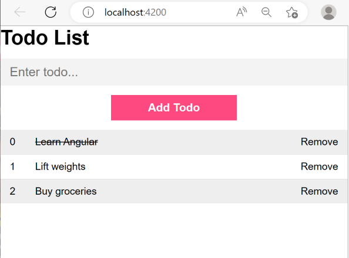

# FirstAngularApp

Angular TODO application for learning purposes, following a tutorial from Tyler Potts on YouTube.

Project template was generated with Angular CLI version 15.0.4.

## Development server

Run `ng serve` for a dev server. Navigate to `http://localhost:4200/`. The application will automatically reload if you change any of the source files.
